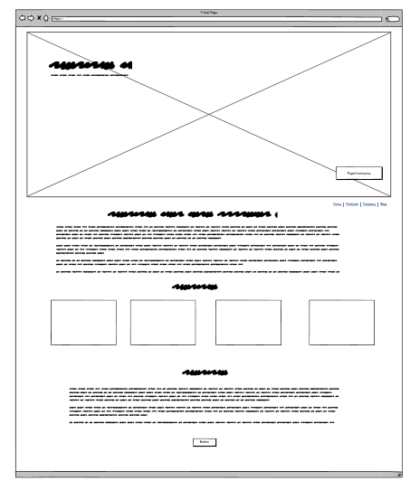

# Prevent Strategy

    <a href="https://ruon90.github.io/individual-project-1/" target="_blank">Live site</a>

## Introduction

This is my first individual project while completing the Code Institute full stack software developer bootcamp.

This project tasked us with creating a website using HTML, CSS and Bootstrap in order to satisfy the given brief within the timeframe.

I opted to do the prevent strategy website as I thought it would be more of a challenge, upon beginning research into the subject matter i realised most people referred to the Prevent program are teenagers, so I decided to make a website that would appeal to teenagers as well as having the information required for adults.

<h2 align="center" id="TOC">Table of contents</h2>

-   [Prevent Strategy](#prevent-strategy)
    -   [Introduction](#introduction)
    -   [Table of Contents](#TOC)
    -   [Project Outline](#project-outline)
-   [Project Planning](#project-planning)
    -   [UX Design](#ux-design)
        -   [User Stories](#user-stories)
        -   [Colors](#colors)
        -   [Fonts](#fonts)
        -   [Imagery](#imagery)
        -   [Wireframes](#wireframes)
-   [Features](#features)
    -   [General Features](#general-features)
        -   [Navigation and Hero Section](#navigation-and-hero-section)
        -   [Bootstrap Cards](#bootstrap-cards)
        -   [Footer](#footer)
        -   [Links and Buttons](#links-and-buttons)
    -   [Responsive Design](#responsive-design)
-   [Built With](#built-with)
    -   [Technology and Languages](#technologies-and-languages)
    -   [Libraries and Frameworks](#libraries-and-frameworks)
    -   [Tools & Programs](#tools-and-programs)
-   [Development](#deployment)
-   [Testing](#testing)
-   [Credits](#credits)
    -   [Code](#code)
    -   [Content Research](#content-research)
    -   [Media](#media)
    -   [Acknowledgements](#acknowledgements)

## Project outline

### External user's goals:

Basic introduction to Prevent strategy, including how to recognize signs of radicalisation and how to report concerns presented in a simple, easy to navigate format.

### Site owner's goals:

Create an informative webpage that introduces the prevent strategy, content should be well organised and easy to digest, with a focus on simplicity and clarity through HTML and CSS with Bootstrap.

<a href="#prevent-strategy">Back To Top</a>

## Project planning

Github projects and repo issues were used to create tasks from user stories, projectboard available <a href="https://github.com/users/Ruon90/projects/8/views/1" target="_blank">here</a>. I then decided on fonts, colour palette and

<a href="#prevent-strategy">Back To Top</a>

## UX design

### User Stories

#### Must haves:

-   As a website owner I want my webpage to be informative and well organised and easy to digest. So that younger users can access the information easily but theres also more substantial information for parents / professionals.

-   As a website owner I want my site to be focussed on simplicity So that everything is easy to find and read.

-   As a website user I want to be able to navigate the information easily So that I can find the relevant information quickly.

-   As a site user I can get a basic introduction to prevent strategy. So that i can understand what the strategy is and how it effects me.

-   As a website user I can learn how to report concerns in relation to the prevent strategy. So that I know where to go to raise any concerns to the relevant bodies.

-   As a website user I want to be able recognise the signs of radicalisation So that I can report anything necessary.

#### Should haves:

-   As a website user I can get access to more comprehensive information that not all users would necessarily need or want. So that I can get all the relevant information from the website.

-   As a website user I can submit my details via a form to be kept up to date with news regarding prevent strategy So that i can keep informed on latest updates.

#### Could haves:

-   As a website user I can download a printable PDF file with the information from the site as a leaflet So that i can give information out to others.

<a href="#prevent-strategy">Back To Top</a>

### Colours

The colour palette was chosen with AI, as the website target audience is younger the colour choices were based on a mixture of Twitch and Tik-Tok.

-   Background colour #1E1E2E (deep indigo, not pure black → softer)

-   Primary Accent: #2EE5A0 (minty green, fresh/optimistic)

-   Secondary Accent: #F72585 (bright magenta, energetic)

-   Highlight / Callout: #FFB703 (warm golden yellow for positivity)

-   Neutral Contrast: #F5F5F5 (light grey/white for text)

<a href="#prevent-strategy">Back To Top</a>

### Fonts

Fonts chosen from google font library.

-   Primary font : Kalam, with cursive fallback.

-   Secondary font : Patrick Hand also with cursive fallback.

<a href="#prevent-strategy">Back To Top</a>

### Imagery

I felt imagery was very important with this site, as it's aimed at younger audiences it is image heavy with lots of bright flashes of colour and a series of cartoon characters to attract the eye.

On top of the images I have also implemented various hover effects and animations through the site as well as extensive CSS styling.

<a href="#prevent-strategy">Back To Top</a>

### Wireframes

Wireframes were created at the start of planning and while they have served as a guide the end product deviates alot from the wireframes as the design naturally progressed.

#### Mobile wireframes:

#### Desktop wireframes:

<a href="#prevent-strategy">Back To Top</a>

## Features:

### General features:

#### Navigation & Hero image

#### Further information page

#### Modal form

#### Success page

#### Footer

#### Links and buttons

## Responsive design

## Built with

### Tech and languages

This website is built using:

-   HTML5
-   CSS3
-   Javascript snippets (imported)

### Libraries

The libraries used for this site are:

-   Bootstrap
-   Google fonts
-   Fontawesome
-   Favicon

## Developement

### Tools & programs

Tools and programs used for development:

-   ChatGPT
-   Gemini
-   Co-Pilot
-   Favicon
-   Krita
-   VS Code
-   Github
-   Mokkify
-   lighthouse
-   W3C Validators
-   Light Youtube embeds by @labnol

### Testing & Validation

Initial testing was done from the user perspective, then lighthouse was used to gauge performance and accessibility. W3C HTML and CSS validators were then used to ensure code was error free. Following on from that Webpagetest was used to gauge performance and loading times.

### Optimisation

Alot of time has been spent optimising the performance of the site, large image size, load order and other factors were initially giving low performance scores on lighthouse (around 55 at one point) you can see the waterfall graph below and the wait time for the site to process.

I proceeded to reduce the image overhead by resizing, reformatting to webp and compressing all files. I then further improved optimisation by adding a facade to the youtube embed, changing the load order in the code and tidying up any left over closing tags etc.

After doing this lighthouse gave the following scores.

 

And the new waterfall chart is as follows.

If you would like to view the full report please click <a href="https://www.webpagetest.org/result/251002_ZiDcAH_8RZ/" target="_blank">here</a>.

## AI

## Content research / references

Content was created using the following sources:

-   <a href="https://homeofficemedia.blog.gov.uk/2024/12/05/prevent-and-channel-factsheet-2024/" target="_blank">Prevent and Channel factsheet – 2024 – Home Office in the media</a>
-   <a href="https://fullfact.org/law/what-prevent-strategy/" target="_blank">What is the Prevent strategy? – Full Fact</a>
-   <a href="https://www.gov.uk/government/publications/prevent-strategy-2011" target="_blank">Prevent strategy 2011 - GOV.UK</a>
-   <a href="https://assets.publishing.service.gov.uk/media/5a78966aed915d07d35b0dcc/prevent-strategy-review.pdf" target="_blank">Prevent review</a>
-   <a href="https://www.counterterrorism.police.uk/what-we-do/counter-terrorism/prevent/" target="_blank">Prevent | Counter Terrorism Policing</a>
-   <a href="https://news.sky.com/story/what-is-prevent-and-why-is-the-anti-terrorism-programme-controversial-13323541" target="_blank">What is Prevent - and why is the anti-terrorism programme controversial? | UK News | Sky News</a>
-   <a href="https://democracy.hants.gov.uk/documents/s135906/2025-06-18%20EAP%20-%20Prevent%20presentation%20June%202025.pdf" target="_blank">PowerPoint Presentation</a>
-   <a href="https://www.libertyhumanrights.org.uk/fundamental/prevent/#:~:text=The%20Prevent%20Strategy%20is%20the%20Government%E2%80%99s%20flagship%20counter-extremism,at%20risk%20of%20committing%20terrorist%20acts%20and%20intervene." target="_blank">Prevent - Liberty</a>
-   <a href="https://www.bbc.co.uk/news/election-2017-40151991" target="_blank">Reality Check: What is the Prevent strategy? - BBC News</a>
-   <a href="https://cpdonline.co.uk/knowledge-base/safeguarding/what-is-prevent/" target="_blank">What is Prevent? | Prevent duty & who is responsible</a>
-   <a href="https://content.eastamb.nhs.uk/assets/What_is_Prevent_0529e8abe1.pdf" target="_blank">What_is_Prevent_0529e8abe1.pdf</a>
-   <a href="https://www.gov.uk/government/publications/new-definition-of-extremism-2024/new-definition-of-extremism-2024" target="_blank">New definition of extremism (2024) - GOV.UK</a>

## Summary
